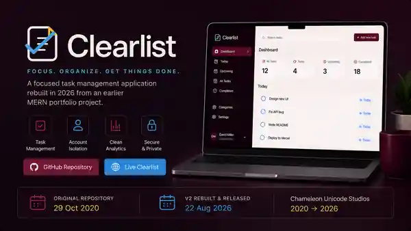

# Clearlist

**Focused task management without the noise.**

Clearlist is a modern full-stack task application rebuilt from an earlier MERN todo project.

The original application was first recovered and preserved in its last known-working form, then secured, modernised and rebuilt while preserving the truthful progression of the original project.

## Project Evolution

Original MERN learning project → recovered and verified → working legacy baseline preserved → dependencies modernised → authentication and data security hardened → frontend rebuilt as Clearlist → responsive and accessibility QA → production-ready release.

## Features

- User registration
- Secure login and logout
- Private authenticated task workspace
- Create and delete tasks
- Persistent MongoDB storage
- Account-owned task data
- User-isolated task retrieval and deletion
- Responsive desktop and mobile interface
- Custom Clearlist identity and navigation
- Accessible forms, labels and interaction states

## Modern Stack

### Frontend

- React 19
- Vite 8
- Redux Toolkit
- React Redux
- Axios
- Vitest
- Testing Library
- Bricolage Grotesque
- Manrope

### Backend

- Node.js
- Express
- MongoDB
- Mongoose
- JSON Web Tokens
- bcryptjs

## Security Modernisation

The original application authenticated users but did not associate individual tasks with their owners.

Clearlist corrects this by:

- assigning each task to the authenticated user
- restricting task retrieval to that user
- restricting deletion to that user
- protecting task routes with authentication
- clearing account-specific task state after logout or authentication failure
- using environment variables for production MongoDB and JWT configuration
- refusing production startup when required secrets are missing

## Quality Assurance

The modernised application has passed:

- Backend automated tests
- Client automated tests
- Functional QA
- Registration and authentication QA
- Task create/delete QA
- Persistence QA
- User-isolation QA
- Responsive desktop/mobile QA
- Mobile navigation QA
- Production build verification
- Lighthouse accessibility audit — **100/100**

WCAG 2.2 AA was used as the accessibility baseline for the public interface.

## Local Development

1. Install backend dependencies with `npm install`.
2. Install client dependencies with `npm install --prefix client`.
3. Copy `.env.example` to `.env`.
4. Configure `MONGO_URI`, `JWT_SECRET` and `PORT=5050`.
5. Start Clearlist with `npm run dev`.

Development services:

- Frontend: `http://localhost:3000`
- Backend: `http://localhost:5050`

## Production Build

Run `npm run build`.

Vite generates the production client in `client/dist`.

## Production Deployment

**Live application:** https://clearlist-chameleon.vercel.app

Production requires:

- `MONGO_URI`
- `JWT_SECRET`
- `NODE_ENV=production`

## Historical Preservation

The original project history has not been overwritten.

A known-working legacy baseline is preserved in the `legacy/working-baseline-2026-08-14` branch so the progression from the earlier MERN implementation to Clearlist remains visible and verifiable.

## Created By

**Chameleon Unicode Studios**

Cape Town, South Africa · 2026

Legacy recovery · Security hardening · Full-stack modernisation

## License

MIT
